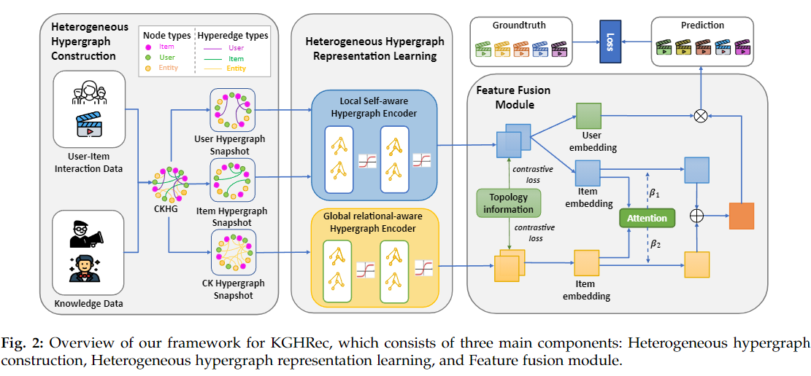

# Overview
This is the official code of our proposal method Knowledge-guided collaborative filtering recommendation with Heterogeneous
Hypergraph Attention (KHGRec) with PyTorch implementation. This project is inspired by and builds upon the code and concepts found in the https://github.com/Coder-Yu/SELFRec.

# Abstract
Recent advancements in Collaborative Filtering(CF) paradigms have focused their attention on the integration of Knowledge Graphs(KGs) to exploit them as the source of auxiliary information. The core idea behind existing KG-aware recommenders is to incorporate rich semantic information so as to lead to more accurate and nuanced recommendations. Despite the significance of such KG-aware CF techniques, there still remain two main challenges they inherently overlook: i) Varied distribution of representations learned from distinctive signals of user-item bipartite graph and KG, which may provocate deterioration of accurate and nuanced recommendations, ii) Complex group-oriented structure that underlies in KGs, which potentially implies richer preference patterns, which may yield to sub-optimal recommendation accuracy. To address these challenges, in this paper, we present a novel Knowledge-guided Heterogeneous Hypergraph Recommender System(KHGRec) to learn the group-wise characteristics of both interaction network and knowledge graph while capturing the complex relation-aware connections in the knowledge graph. Based on the novel construction of collaborative knowledge heterogeneous hypergraph(CKHG), two different hypergraph encoders aim to model group-wise interdependencies while ensuring the explainability of recommendation results. We further fuse different signals retrieved from two input graphs with cross-view self-supervised learning and attention mechanisms. Extensive empirical experiments on two real-world datasets validate the superiority and effectiveness of our model over various state-of-the-art baselines. The implementation of our model and evaluation datasets are publicly available at: https://github.com/vuviethung1998/KHGRec.



##  Install package
```
pip install -r requirements.txt
```
## Data
Download data from [link](https://1drv.ms/f/s!Agv-dcspzdTqkU49ZfHPpUVAGWsj?e=BFys4A)

Download this file, then decompress this file and locate it at the path like that /path-to-repo/dataset.

This file contains data from ML-1M and LastFM dataset

## Pretrained weight 
Download the pretrained weight from [link](https://1drv.ms/f/s!Agv-dcspzdTqkU8ByenxSMKZ_d-5?e=NhAMMI)

## Training 
To train the model from scratch with the default setting

**LastFM**
```
python main.py --model=KHGRec --dataset=lastfm  --lrate=0.0001 --weight_decay=5e-6 --drop_rate=0.2 --p=0.3 --cl_rate=1e-05 --temp=0.2 --reg=0.1 --early_stopping_steps=20
```

## Parameters 
* ```--model``` Selected model name.
* ```--gpu_id``` Id of GPU.
* ```--dataset``` Dataset name.
* ```--alpha``` KG Loss regularizer hyperparameters.
* ```--lrate``` Selected learning rate.
* ```--item_ranking``` Top items to evaluate.
* ```--item_ranking``` Top items to evaluate.
* ```--max_epoch``` Maximum epoch to run.
* ```--batch_size``` Selected batch size.
* ```--hyperedge_num``` Number of hyperedges.
* ```--batch_size_kg``` Selected knowledge batch size.
* ```--n_layers``` Number of model's layers.
* ```--embedding_size``` Embedding size.
* ```--input_dim``` Input dimension.
* ```--relation_dim``` Relational embedding dimension.
* ```--hyper_dim``` Hypergraph embedding dimension.
* ```--lr_decay``` Learning rate decay.
* ```--weight_decay``` Weight decay.
* ```--reg``` Lambda when calculating KG l2 loss.
* ```--reg_kg``` Lambda when calculating CF l2 loss.
* ```--p``` Leaky.
* ```--drop_rate``` Drop rate.
* ```--nheads``` Num of heads.
* ```--temp``` Temperature term.
* ```--cl_rate``` Contrastive rate.
